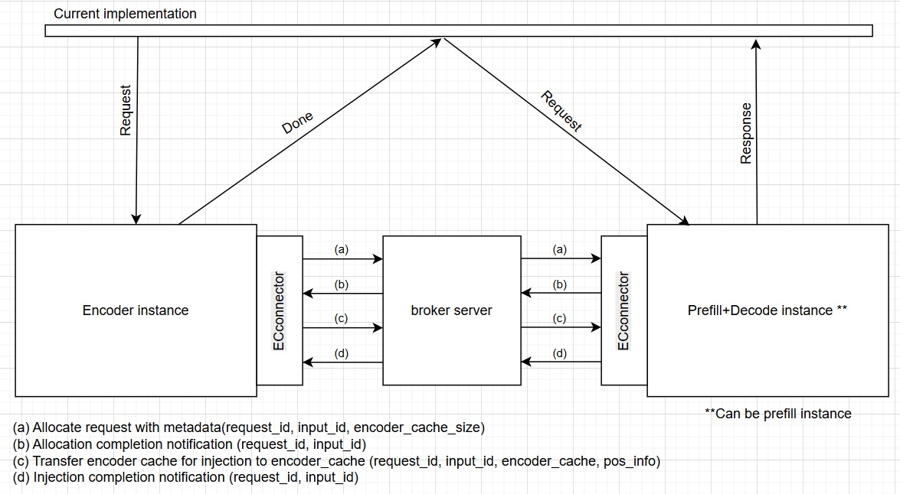

### Approach Description:



### Current Implementation:

1. Encoder Cache Transfer
   The encoder cache transfer consists of two main components:  

   i. Broker: An intermediate server responsible for load balancing and data transfer. The current implementation is a placeholder to make the encoder separation code runnable, simple, and free of additional dependencies. Since the encoder cache is much smaller than the KV-cache, the broker's data transfers do not create a high workload. Therefore, a Redis-based broker should be sufficient for this purpose.
  
   ii. Encoder Cache Connector: A part of the instance that provides an interface for data transfer, executed in a separate thread.  

   The communication process involves four steps:  
   - The encode instance in the scheduler sends metadata to the next instance.  
   - The prefill (or prefill-decode) instance receives the metadata in the scheduler, adds it to the queue, allocates space using the encoder cache manager, and sends an allocation completion notification.  
   - The encode instance receives the notification in the model runner and sends the encoder cache to the next instance.  
   - The prefill (or prefill-decode) instance receives the encoder cache in the model runner, adds it to the queue, stores it in the `encoder_cache` dictionary, and sends an injection completion notification.  

   This communication model is designed to prevent out-of-memory issues during transfer, preliminary performance optimizations are not applied, and there are many inefficient places. Currently the communication is partially asynchronous and partially synchronous. Separate threads are receiving/sending data, but the injections and allocations are handled synchronically, it can be changed.

2. Encoder Instance  
   To maintain compatibility with vLLM, the encoder instance uses the same `EngineCore`, `GPU_Worker`, etc., while replacing `gpu_model_runner` with `encoder_gpu_model_runner` and `scheduler` with `encoder_scheduler`.  
   Since `encoder_scheduler` and `encoder_gpu_model_runner` have the same interface as `scheduler` and `gpu_model_runner`, minimal changes are done in the `vllm/v1/`. The only modifications related to encoder instance is selecting the correct scheduler and model runner in `vllm/v1/engine/core.py` and `vllm/v1/worker/gpu_worker.py`.

    The encoder instance returns an empty output, for two purposes: to notify the proxy server that the cache has been injected and requests can be sent to the Prefill (or Prefill-Decode) instance, and to prevent hanging requests.

3. Prefill (or Prefill-Decode) Instance  
   A standard vLLM instance with `ec_connector` component in `gpu_model_runner` and `scheduler`. It also includes related functions for encoder cache transfer and injection. More details are provided in the code description.  

---

### Code changes:

`vllm/separated_encoder`:  
A new module that contains encoder instance components, components for encoder cache transfer and utilities for it.  

- `vllm/separated_encoder/encoder_cache_transfer/broker.py`:  
  - An intermediate server for data transfer and load balancing (currently, load balancing is not implemented).  
  - Contains four "channels":  
    - 0: Successful allocation notifications(P->E).  
    - 1: Successful encoder cache injection notifications (P->E).  
    - 2: Metadata transfer (E->P).  
    - 3: Encoder cache transfer (E->P).  

- `vllm/separated_encoder/encoder_cache_transfer/ec_connector.py`:  
  - Contains send and receive methods for each transfer operation.  
  - Receiving is implemented via callback passing: in separate thread we create the receive request and this receive request will execute the callback on data receive.  

- `vllm/separated_encoder/encoder_scheduler/encoder_scheduler.py`:  
  - A First-Come-First-Serve (FCFS) greedy scheduler for multimodal data encoding.  
  - Sends allocation requests to the prefill instance and receives injection completion notifications via the `ec_connector`, which runs in a separate thread.  
  - On each injection completion notification, the scheduler adds the completed `request_id` and `input_id` to the main thread's queue.  
  - During the main thread's scheduling run, it aborts injected requests on the encoded instance to avoid "hanging requests." It later deletes the request during the `update_from_output` phase.  
  - The rest of the functionality is similar to the vLLM scheduler.  

- `vllm/separated_encoder/worker/encoder_gpu_model_runner.py`:  
  - A GPU model runner for the encoder instance, adapted from the original `gpu_model_runner`.  
  - Receives allocation notifications using the same logic as injection notifications.  
  - Sends the encoder cache to the prefill (or prefill-decode) instance during the `execute_model` phase.  
  - KV-cache related methods removed
  - Profile run runs only encoder model

- `vllm/separated_encoder/worker/utils.py`:  
  - Contains methods to convert `PlaceholderRange` objects (`mm_inputs pos_info`) into serializable objects for transfer.  

---

`vllm/v1`:  
Changes in `vllm/v1` enable injection of encoder cache into the prefill (or prefill-decode) instance. Memory allocation is handled in the scheduler, and the encoder cache is inserted into the model runner. Deallocation is managed correctly by the original scheduler and model executor.  

(Currently, prefill (or prefill-decode) instance receives request only after all of its multimodal inputs are injected. A different approach requires more changes and more complex logic, will be done later.)  

- `vllm/v1/core/sched/scheduler.py` (Scheduler for prefill instance):  
  - Initializes the encoder cache connector (`ec_connector`) and related methods.  
  - The `ec_connector` runs in a separate thread, queuing all incoming allocation requests in `waiting_alloc`.  
  - During `.schedule()`, the main thread uses `maybe_allocate_recvd_metadata` to handle incoming requests without blocking the main thread.  
  - Once memory is allocated for an encoder cache, a notification is sent to the encoder instance.  
  - Encoder cache space is allocated in FCFS order.  
  - Contains a callback function that is triggered by the `ec_connector` on each data transfer.  

- `vllm/v1/core/encoder_cache_manager.py`:  
  - New methods `allocate_disag`, `can_allocate_disag`, and `has_cached_inputs`, which use only `request_id`, `input_id`, and `encoder_cache_size` to avoid sending the entire request information to another instance.  

- `vllm/v1/engine/core.py`:  
  - Adjustments in scheduler selection for disaggregated serving (uses `EncoderScheduler` on the encoder instance).  

- `vllm/v1/engine/gpu_worker.py`:  
  - Adjustments in model runner selection for disaggregated serving (uses `EncoderGPUModelRunner` on the encoder instance).  

- `vllm/v1/worker/gpu_model_runner.py`:  
  - Initialization of the encoder cache connector (`ec_connector`) and related methods.  
  - The `ec_connector` initializes receive threads, and from this receive threads ec_connector calls function that will add received data into the `encoder_cache` dictionary.  
  - Additional assertion in `_execute_mm_encoder` to prevent encoder usage on prefill (or prefill-decode) instances.  

- `vllm/config.py` \& `vllm/engine/arg_utils.py`
  - Add config for epd disaggregation

---

### Usage Instructions

Run the following script to launch the EPD serving-related servers:

   ```bash
   bash examples/online_serving/encoder_separation/launch_epd_serve.sh
   ```

Use the following command to send parallel requests:  

   ```bash
   python examples/online_serving/encoder_separation/parallel_separated_encoder_request.py --port_encode 19534 --port_prefill_decode 19535 --model_path /workspace/vllm/Qwen2.5-VL-3B-Instruct --image_path docs/assets/design/arch_overview/entrypoints.excalidraw.png
   ```
